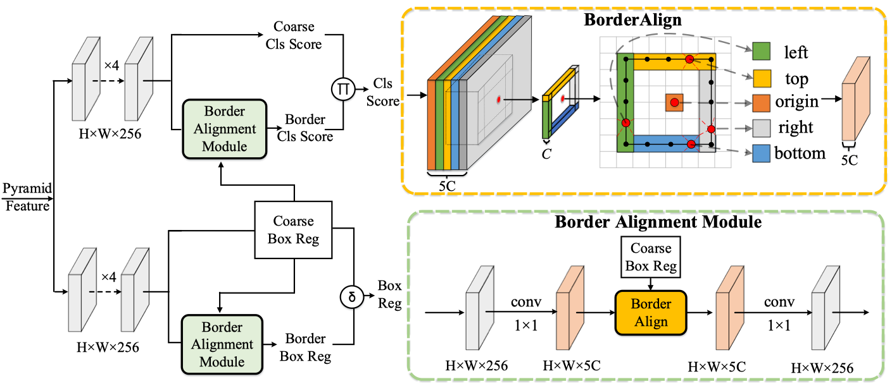

# BorderDet

This project provides an implementation for "BorderDet: Border Feature for Dense Object Detection" (*ECCV2020 Oral*) on PyTorch.

For the reason that experiments in the paper were conducted using internal framework, this project reimplements them on cvpods and reports detailed comparisons below.

<center></center>

## Requirements
* Python >= 3.6
* PyTorch >= 1.3
* torchvision >= 0.4.2
* OpenCV
* pycocotools: pip install cython; pip install 'git+https://github.com/cocodataset/cocoapi.git#subdirectory=PythonAPI'
* GCC >= 4.9

## Get Started
```shell
git clone --recursive https://github.com/Megvii-BaseDetection/BorderDet

cd BorderDet

# build cvpods (requires GPU)
pip install -r requirements.txt
python setup.py build develop

# preprare data path
mkdir datasets
ln -s /path/to/your/coco/dataset datasets/coco

cd playground/detection/coco/borderdet/borderdet.res50.fpn.coco.800size.1x

# Train
pods_train --num-gpus 8
# Test
pods_test --num-gpus 8 \
    MODEL.WEIGHTS /path/to/your/save_dir/ckpt.pth # optional
    OUTPUT_DIR /path/to/your/save_dir # optional

# Multi node training
## sudo apt install net-tools ifconfig
pods_train --num-gpus 8 --num-machines N --machine-rank 0/1/.../N-1 --dist-url "tcp://MASTER_IP:port"

```

## Results on COCO
For your convenience, we provide the performance of the following trained models. All models are trained with 16 images in a mini-batch and frozen batch normalization. All model including X_101/DCN_X_101 will be released soon.

| Model | Multi-scale training | Multi-scale testing | Testing time / im | AP (minival) | Link |
|:---:  |:--------------------:|:--------------------:|:-----------------:|:-------:|:---:|
| [FCOS_R_50_FPN_1x](https://github.com/Megvii-BaseDetection/BorderDet/blob/master/playground/detection/coco/fcos/fcos.res50.fpn.coco.800size.1x) | No | No | 54ms | 38.7 | [Google](https://drive.google.com/file/d/1hcDobxvqolMwqj20BEAPikSMcz4NYZRx/view?usp=sharing)
| [BD_R_50_FPN_1x](https://github.com/Megvii-BaseDetection/BorderDet/blob/master/playground/detection/coco/borderdet/borderdet.res50.fpn.coco.800size.1x) | No | No | 60ms | 41.4 | [Google](https://drive.google.com/file/d/1nhGA0TYtwGp_RMwPoZDAPbZ_TNL8-XCj/view?usp=sharing)
| [BD_R_101_FPN_1x](https://github.com/Megvii-BaseDetection/BorderDet/blob/master/playground/detection/coco/borderdet/borderdet.res101.fpn.coco.800size.2x) | Yes | No | 76ms | 45.0 | [Google](https://drive.google.com/file/d/1LEbLZwP_9eKbpZXC52D5B_V85A4pr9eE/view?usp=sharing)


## Acknowledgement
cvpods is developed based on Detectron2. For more details about official detectron2, please check [DETECTRON2](https://github.com/facebookresearch/detectron2/blob/master/README.md).


## Contributing to the project
Any pull requests or issues are welcome.